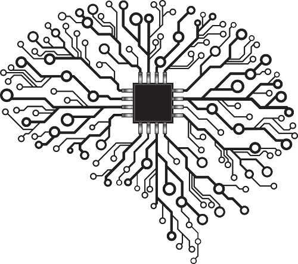
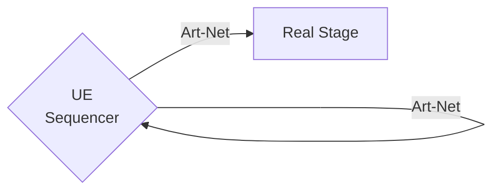
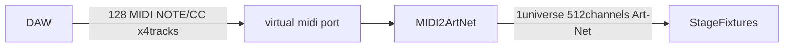

## Generic Test
### Attachment Test (Image files)
- Obsidian Drag&Drop Style 1
  ![[Publish/gatsby-garden/_notes/images/Lenna_(test_image).png]
- Obsidian Drag&Drop Style 2
  ![[Publish/gatsby-garden/_notes/images/Lenna_(test_image).png]] 
- Standard Style
   
   
   
  
<!--  -->

### URL Link Test
[Invalid Relative Page Link - Same Directory](simple-page.md)
[Invalid Relative Page Link - Child Directory](/nested/subpage_nested.md)

[Valid Relative Page Link - Same Directory](/simple-page)
[Valid Relative Page Link - Child Directory](/nested/subpage_nested)

### Youtube Embed Test
- Youtube
<iframe width="560" height="315" src="https://www.youtube.com/embed/TjAa0wOe5k4" title="YouTube video player" frameborder="0" allow="accelerometer; autoplay; clipboard-write; encrypted-media; gyroscope; picture-in-picture" allowfullscreen></iframe>

twitch
<iframe src="https://player.twitch.tv/?video=134685193&parent=www.example.com" frameborder="0" allowfullscreen="true" scrolling="no" height="378" width="620"></iframe>

### Mermaid Test

## obsidian-vimrc-support TEST
[[wiki]]

[test]()
[test](https://github.com/esm7/obsidian-vimrc-support)
